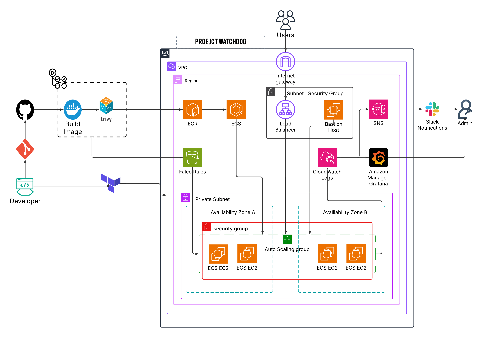

# WatchDog – Cloud-Native Container Security & Compliance System

<div align="center">

**Comprehensive container security monitoring covering the entire lifecycle from build to runtime**

[](https://github.com/ofor-david/watchdog/actions)
[](https://opensource.org/licenses/MIT)
[](https://www.python.org/downloads/release/python-312/)
[](https://aws.amazon.com/)

⚠️ **Development Status**: This project is actively under development. Expect frequent changes and potential bugs.

</div>

---

## Table of Contents

- [Problem Statement & Solution](#problem-statement-and-solution)
- [Key Features & Capabilities](#key-features-and-capabilities)
- [Architecture Overview](#architecture-overview)
- [Technology Stack](#technology-stack)
- [Prerequisites & Requirements](#prerequisites-and-requirements)
- [Quick Start Guide](#quick-start-guide)
- [Terraform Modules Structure](#terraform-modules-structure)
- [CI/CD Pipeline Setup](#cicd-pipeline-setup)
- [API Documentation](#api-documentation)
- [Troubleshooting Guide](#troubleshooting-guide)
- [Contributing Guidelines](#contributing-guidelines)
- [Security Development Practices](#security-development-practices)
- [Roadmap & Future Plans](#roadmap-and-future-plans)
- [Cost Considerations](#cost-considerations)
- [Contact](#contact)

---

## Problem Statement and Solution

### Security Pain Points Addressed

**WatchDog** tackles critical container security challenges that organizations face in production environments:

#### **Container Image Vulnerabilities in CI/CD**
- **Problem**: Manual vulnerability scanning leads to vulnerable images in production
- **Solution**: Automated Trivy scanning in GitHub Actions with build-breaking on HIGH/CRITICAL vulnerabilities

#### **Runtime Security Monitoring Gaps** 
- **Problem**: Limited visibility into container behavior after deployment
- **Solution**: Runtime Security and active threat detection with Falco
#### **Manual Security Processes That Don't Scale**
- **Problem**: Security teams overwhelmed by manual processes
- **Solution**: Automated response mechanisms and policy-driven security controls

---

## Key Features and Capabilities

### **Build-time Security**
- **Vulnerability Scanning**: Trivy integration scanning for CRITICAL and HIGH severity vulnerabilities
- **Secure Base Images**: Multi-stage Docker builds with minimal attack surface
- **Registry Security**: ECR integration with automatic image scanning on push
- **Build-Breaking Security**: CI/CD pipeline fails on security violations

### **Runtime Threat Detection with Falco**
- **Custom Security Rules**: S3-based rule management with automated updates
- **Real-time Alerting**: CloudWatch Logs integration for security event collection
- **Host Monitoring**: Comprehensive coverage of ECS instances

### **Runtime Monitoring**
- **Performance Monitoring**: Resource usage and performance metrics(in developement)

### **Infrastructure Security**
- **Secure AWS Deployment**: Production-ready AWS architecture with security best practices
- **Network Segmentation**: VPC with proper security groups and network isolation
- **Identity & Access Management**: Least-privilege IAM roles and policies
- **SSL/TLS Termination**: ALB with ACM certificate integration
- **HTTPS Redirect**: Automatic HTTP to HTTPS redirection
- **Domain-based Deployment**: Support for custom domain names

### **Observability & Monitoring(In developement)**
- **Container Insights**: Deep visibility into ECS cluster and task performance
- **Health Monitoring**: Application and infrastructure health checks
- **Centralized Logging**: Structured logging with centralized collection
- **Custom Metrics**: Security-focused metrics and dashboards

### **Automation & Scaling**
- **Dual-level Scaling**: Both ECS service tasks and EC2 instances auto-scale
- **Self-healing**: Automatic replacement of unhealthy containers
- **Infrastructure as Code**: Complete infrastructure automation with Terraform
- **GitOps Integration**: Git-based deployment and configuration management
- **CPU Target Tracking**: Configurable CPU utilization targets
- **Instance Lifecycle Management**: Automatic instance replacement with configurable lifetime

---

## Architecture Overview

### High-Level System Architecture


### Component Breakdown

#### **FastAPI Application Core**
- Lightweight Python web framework serving security APIs
- Health check endpoints for monitoring

#### **AWS ECS Cluster with Auto-scaling**
- Container orchestration with automatic scaling
- Capacity providers for efficient resource utilization
- Service auto-scaling based on CPU metrics

#### **Application Load Balancer**
- High availability with multi-AZ deployment
- Health checks and automatic failover
- SSL/TLS termination

#### **ECR Repository with Security**
- Private container registry with vulnerability scanning
- Integration with CI/CD for automated deployments

#### **VPC with Security Controls**
- Network isolation with public/private subnets
- Security groups with least-privilege access

#### **Bastion Host for Secure Access**
- SSH access point in public subnet for administrative tasks
- Secure gateway for accessing private resources
- Integrated with security groups for controlled access

### Security Boundaries & Trust Zones

1. **Internet Boundary**: ALB with public access, security groups filtering traffic
2. **Application Boundary**: ECS tasks in private network, only ALB access allowed  
3. **Management Boundary**: IAM roles with least privilege, no root access

---

## Technology Stack

### **Backend & Application**
- **Python 3.12**: Latest Python with enhanced security features
- **FastAPI**: Modern, high-performance web framework
- **Uvicorn**: ASGI server with excellent performance

### **Infrastructure & Cloud**
- **AWS ECS**: Container orchestration and management
- **AWS ECR**: Private container registry with security scanning
- **AWS ALB**: Application load balancing and SSL termination
- **AWS VPC**: Network isolation and security
- **AWS IAM**: Identity and access management
- **AWS CloudWatch**: Monitoring, logging, and alerting

### **Infrastructure as Code**
- **Terraform**: Infrastructure provisioning and management
- **Modular Architecture**: Reusable Terraform modules for scalability
- **State Management**: Remote state storage (S3 + DynamoDB in development)

### **CI/CD, Security, and Logging**
- **GitHub Actions**: Automated CI/CD pipelines
- **Trivy**: Comprehensive vulnerability scanner
- **Falco**: Runtime security monitoring and threat detection
- **Security Scanning**: Automated security checks in pipeline
- **Docker**: Containerization with multi-stage and least privilege builds
- **CloudWatch Logs**: Centralized logging for Falco security events
- **S3**: Secure storage for Falco custom rules with versioning


## Prerequisites and Requirements

### **System Requirements**
- **AWS Account**: With programmatic access
- **Docker**: Version 20.10 or later
- **Terraform**: Version 1.0 or later  
- **Python**: Version 3.12 or later
- **Git**: For version control and CI/CD

### **Local Development Requirements**
- **SSH Key Pair**: For EC2 instance access (create in AWS Console)
- **AWS CLI**: Configured with appropriate credentials
- **Make**: For running development tasks (recommended)

### **Security Requirements**
- **MFA Enabled**: Multi-factor authentication on AWS account
- **Secure Credential Storage**: Use AWS IAM roles or secure credential management
- **Network Security**: Understand VPC and security group implications
- **Domain & SSL Certificate**: Valid domain with ACM certificate for HTTPS
- **Local IP Configuration**: Your public IP address for bastion host access

---

## Quick Start Guide

### **Step 1: Clone Repository**
```bash
git clone https://github.com/yourusername/watchdog.git
cd watchdog
```

### **Step 2: Configure AWS Credentials**
```bash
cd terraform

# Create terraform.tfvars file
cp terraform.example.tfvars terraform.tfvars

# Edit with your values
nano terraform.tfvars
```

### **Step 3: Deploy ECR First**
```bash
terraform init
terraform apply -target=module.ecr 
# Get ALB DNS name from Terraform output
terraform output alb_dns_name
```


### **Step 4: Build and Push Container**
```bash
# Get ECR login token
aws ecr get-login-password --region us-east-1 | docker login --username AWS --password-stdin your-account.dkr.ecr.us-east-1.amazonaws.com

# Build and push (or use GitHub Actions)
docker build -t watchdog:latest .
docker tag watchdog:latest your-account.dkr.ecr.us-east-1.amazonaws.com/watchdog-repo:latest
docker push your-account.dkr.ecr.us-east-1.amazonaws.com/watchdog-repo:latest
```

### **Step 5: Deploy Infrastructure**
```bash
terraform plan
terraform apply 
```

### **Step 6: Access Application**
```bash
# Get ALB DNS name from Terraform output
terraform output alb_dns_name

# Test the application
curl -v http://your-alb-dns-name/api
```
### **Step 7: Deploy Falco Security Rules**
```bash
# Deploy Falco rules using the dedicated workflow
git add falco/custom_rules.yaml
git commit -m "Update Falco rules"
git push origin main

# Or deploy manually to S3
aws s3 cp falco/custom_rules.yaml s3://your-falco-bucket/custom_rules.yaml
```
### **Step 8: Verify Security Features**
- Check ECR vulnerability scan results in AWS Console
- Monitor Falco logs in CloudWatch
- Review security group configurations
- Validate IAM role permissions

---

## **Terraform Modules Structure**
The infrastructure is organized into reusable modules:

```
terraform/
├── main.tf              # Root module orchestration
├── variables.tf         # Root variables
├── outputs.tf           # Root outputs
├── provider.tf          # AWS provider configuration
├── modules/
    ├── bastion/        # Bastion host for secure access
    ├── falco/          # Falco security monitoring setup
    ├── vpc/            # Network infrastructure
    ├── security_group/ # Security groups
    ├── iam/            # IAM roles and policies
    ├── ecr/            # Container registry
    ├── ecs_cluster/    # ECS cluster and launch template
    ├── ecs_service/    # ECS service and task definition
    ├── alb/            # Application load balancer
    └── asg/            # Auto scaling group
```

### **CI/CD Pipeline Setup**

#### **GitHub Secrets Configuration**
Configure the following secrets in your GitHub repository:

```
AWS_ACCESS_KEY: Your AWS access key
AWS_SECRET_KEY: Your AWS secret key  
AWS_REGION: Your AWS region (e.g., us-east-1)
ECR_REPOSITORY: Your ECR repository name (e.g., watchdog-repo)
FALCO_BUCKT_NAME: Falco Bucket Name from terraform ouput
```

#### **Workflow Explanation**
The CI/CD pipeline (`.github/workflows/ci.yml`) performs:

1. **Security Scanning**: Trivy scans for vulnerabilities
2. **Build Breaking**: Fails on HIGH/CRITICAL vulnerabilities
3. **Image Building**: Creates optimized Docker image
4. **Registry Push**: Pushes to ECR with automatic deployment

#### **Security Scanning Integration**
The Trivy scanner configuration:
```yaml
- name: Run Trivy vulnerability scanner
  uses: aquasecurity/trivy-action@0.28.0
  with:
    scan-type: 'fs'
    format: 'table'
    exit-code: '1'              # Fail build on vulnerabilities
    ignore-unfixed: true        # Ignore unfixed vulnerabilities
    severity: 'CRITICAL,HIGH'   # Only fail on critical/high
    timeout: '5m'
```
#### **Falco Rules Deployment Pipeline**
The Falco workflow (`.github/workflows/falco_workflow.yml`) performs:

1. **Rule Validation**: Ensures custom rules are properly formatted
2. **S3 Deployment**: Uploads rules to dedicated S3 bucket
3. **Automatic Updates**: EC2 instances pull updated rules via cron job

---
## API Documentation

### **Current Endpoints**

#### **GET /api**
Basic health check endpoint.

**Request:**
```bash
# Health check with HTTPS
curl https://yourdomain.com/api

# Or using ALB DNS directly
curl https://your-alb-dns-name/api
```

**Response:**
```json
{
  "Hello from Project Watchdog!"
}
```

**Response Codes:**
- `200 OK`: Application is healthy
- `500 Internal Server Error`: Application error

## Troubleshooting Guide

#### **Useful Terraform Outputs**
```bash
# Get important deployment information
terraform output alb_dns_name          # ALB DNS for testing
terraform output ecr_repo_name          # ECR repository name
terraform output falco_bucket_name      # S3 bucket for Falco rules
terraform output bastion_ssh_command    # SSH command for bastion access
```
### **Common Issues**

#### **Terraform Deployment Failures**

**Issue: "Error creating ECR repository"**
```bash
Error: Error creating ECR repository: InvalidParameterException: Repository name "watchdog-repo" already exists
```

**Solution:**
```bash
# Check existing repositories
aws ecr describe-repositories

# Either delete existing repo or change name in variables
terraform destroy -target=module.ecr
terraform apply
```

**Issue: "No available subnets for ALB"**
```bash
Error: ALB requires at least 2 subnets in different AZs
```

**Solution:**
- Ensure your AWS region has at least 2 availability zones
- Check VPC module creates subnets in different AZs
- Verify subnet configurations in `terraform/modules/vpc/main.tf`

#### **Load Balancer Health Check Failures**

**Issue: ALB showing unhealthy targets**
```bash
# Check target group health
aws elbv2 describe-target-health --target-group-arn <target-group-arn>
```

**Common Causes:**
1. **Wrong Health Check Path**: ALB checks `/api`, app serves different path
2. **Security Group Rules**: Traffic blocked between ALB and ECS
3. **Container Not Binding**: App not listening on 0.0.0.0:8000
4. **Startup Time**: App takes longer than health check grace period

**Solution:**
```bash
# 1. Verify health check configuration
aws elbv2 describe-target-groups --names watchdog-tg

# 2. Test health check path directly
# SSH to EC2 instance and curl localhost:container-port/api

# 3. Check security groups
aws ec2 describe-security-groups --group-names watchdog-sg watchdog-alb-sg
```

#### **Development Environment Issues**

1. **Local Container Storage Limitations**
   - **Issue**: No persistent storage for development
   - **Workaround**: Use external databases or mock services
   - **Solution**: Add Docker Compose with persistent volumes

2. **Resource Constraints on t2.micro**
   - **Issue**: Limited CPU/memory on free tier instances
   - **Workaround**: Use t3.small or higher for production
   - **Solution**: Implement resource monitoring and right-sizing

#### **HTTPS/SSL Certificate Issues**

**Issue: "Certificate not found for domain"**
```bash
Error: No certificate found for domain yourdomain.com
```
**Solution:**
- Ensure ACM certificate exists in the same region
- Verify domain validation is complete
- Check certificate status in AWS Console

### **Falco Rules Deployment Issues**
**Issue: "Access denied to S3 bucket"**

**Solution:**
- Verify IAM roles have S3 access permissions
- -Check bucket name matches terraform output
- Ensure GitHub Actions secrets are configured correctly
---

### **Contributing Guidelines**
1. **Fork the Repository**
2. **Create Feature Branch**: `git checkout -b feature/your-feature-name`
3. **Make Changes**: Follow coding standards
4. **Run Tests**: Ensure all tests pass
5. **Security Scan**: Run local security scans
6. **Submit Pull Request**: Include description and tests

### **Security Development Practices**
1. **Input Validation**: Validate all user inputs
2. **Error Handling**: Don't expose sensitive information in errors
3. **Dependency Management**: Regular security updates
4. **Secret Management**: Never commit secrets to code
5. **Least Privilege**: Minimal required permissions
6. **Runtime Security Monitoring**: Falco rules for container behavior analysis
7. **Infrastructure Security**: Bastion host for controlled administrative access
8. **SSL/TLS Encryption**: End-to-end encrypted communications


## Roadmap and Future Plans

### **Current Limitations**
1. **CI/CD Pipeline**
   - No automatic deployment on ECR image push
   - Manual ECS service updates required
   - **Priority**: High - affects development velocity

2. **Security Monitoring**
   - Limited runtime security monitoring
   - Basic vulnerability scanning only
   - **Priority**: Medium - core feature expansion

3. **Observability**
   - Basic health checks only
   - Limited custom metrics
   - **Priority**: Medium - operational visibility

#### **Planned Features**
- **Runtime Behavior Analysis**: Container activity monitoring
- **Automatic Deployment**: ECS service updates on image push
- **Blue/Green Deployments**: Zero-downtime deployments
- **Rollback Capabilities**: Automatic rollback on deployment failures

### **Technical Debt**

#### **Infrastructure Improvements**
- **State Management**: Terraform remote state with S3 + DynamoDB
- **Module Versioning**: Semantic versioning for Terraform modules

#### **Security Enhancements**
- **TLS/SSL Configuration**: HTTPS with SSL certificates
- **Secret Management**: AWS Secrets Manager integration

## Cost Considerations

### **AWS Resource Costs**

#### **Estimated Cost Breakdown by Service**

**Compute Costs:**
- **ECS Tasks**: No additional charge (pay for EC2 instances)
- **EC2 Instances**: Primary cost driver
  - t2.micro: $8.50/month (free tier eligible)
  - t3.small: $15.00/month (better performance)
  - t3.medium: $30.00/month (production recommended)

**Storage Costs:**
- **ECR Storage**: $0.10/GB/month
- **EBS Volumes**: $0.10/GB/month (GP2)
- **CloudWatch Logs**: $0.50/GB/month (after free tier)

**Network Costs:**
- **ALB**: $0.0225/hour ($16.20/month) + $0.008/LCU
- **Data Transfer**: $0.09/GB (after 1GB free)

#### **Cost Optimization Strategies**

**Instance Selection:**
```hcl
# Development
instance_type = "t2.micro"    # $8.50/month, free tier eligible

# Staging  
instance_type = "t3.small"    # $15.00/month, good for testing

# Production
instance_type = "t3.medium"   # $30.00/month, production ready
```

#### **AWS Free Tier Benefits (First 12 Months)**
- **EC2**: 750 hours of t2.micro instances per month
- **ELB**: 750 hours of Application Load Balancer
- **ECR**: 500MB of storage per month
- **CloudWatch**: 5GB of log data per month
- **Data Transfer**: 1GB per month

## Contact

Built with ❤️ by Ofor David Tochukwu
*Open to feedback and collaboration.*
*My Email: [davidoforincloud@gmail.com](mailto:davidoforincloud@gmail.com)*